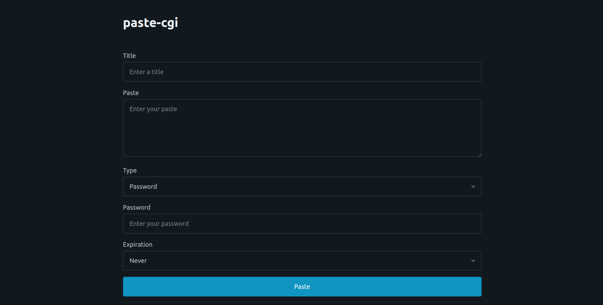
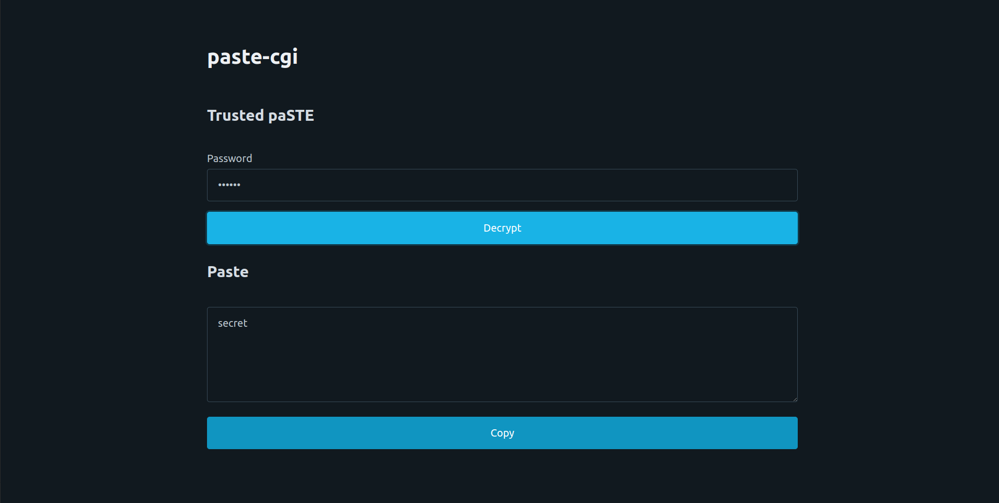

# Paste-cgi

## Description

This is a dirty pastebin done in CGI. It is completely client-side encrypted and server only stores encrypted paste(Title is not encrypted).

## Images




## Nginx Config

```cfg
server {
    server_name paste.example.com;
    root /example/root/dir;

    # Global basic Auth 
    auth_basic "Restricted Content";
    auth_basic_user_file /etc/nginx/.htpasswd;

    # Server static files
    location = / {
        try_files /index.html =404;
    }

    location = /get {
        try_files /get.html =404;
    }

    location ~* \.(css|js|svg)$ {
        try_files $uri =404;
        access_log off;
        expires 30d;
    }

    # Handle cgi routes
    location ~ ^/(paste|submit)$ {
        include fastcgi_params;
        fastcgi_param SCRIPT_FILENAME /example/path/to/cgi;
        fastcgi_param PATH_INFO $uri;
        fastcgi_param QUERY_STRING $args;
        fastcgi_param HTTP_HOST $server_name;
        fastcgi_param CONTENT_LENGTH $content_length;
        fastcgi_param CONTENT_TYPE $content_type;
        fastcgi_param ALLOWED_DIR /example/allowed/dir;
        fastcgi_pass unix:/run/fcgiwrap.socket;
    }
    # Deny everything else
    location / {
        return 403;
    }

    listen [::]:443 ssl; # managed by Certbot
    listen 443 ssl; # managed by Certbot
    ssl_certificate /etc/letsencrypt/live/paste.cirakg.xyz/fullchain.pem; # managed by Certbot
    ssl_certificate_key /etc/letsencrypt/live/paste.cirakg.xyz/privkey.pem; # managed by Certbot
    include /etc/letsencrypt/options-ssl-nginx.conf; # managed by Certbot
    ssl_dhparam /etc/letsencrypt/ssl-dhparams.pem; # managed by Certbot

}
server {
    if ($host = paste.cirakg.xyz) {
        return 301 https://$host$request_uri;
    } # managed by Certbot


    listen 80;
    listen [::]:80;

    server_name paste.cirakg.xyz;
    return 404; # managed by Certbot


}

```
